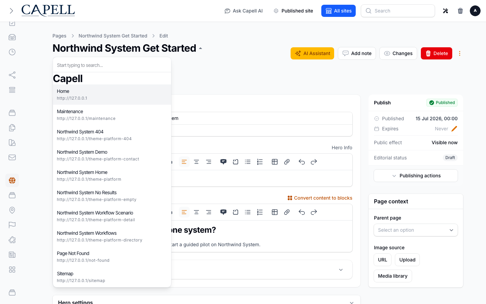
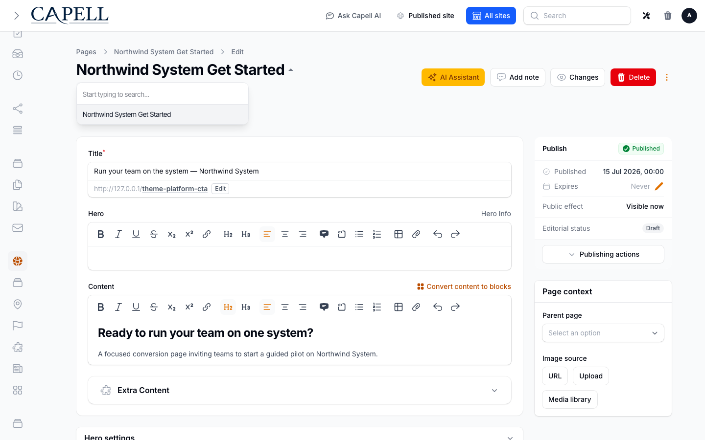

# Record Switcher

<!-- prettier-ignore-start -->

## What This Plugin Adds

Record Switcher is an **Available**, **No schema impact** Capell package in the **Capell Foundation** product group. It ships as `capell-app/record-switcher` and extends these surfaces: admin.

Record Switcher adds a compact selector to supported Filament record headings so users can move between nearby records without returning to the list page.

On supported edit pages, admin users can search the current resource and open another permitted record from the heading.

Evidence: [`src/Filament/RecordSwitcherHeadingExtender.php`](src/Filament/RecordSwitcherHeadingExtender.php), [`src/Actions/BuildRecordSwitcherOptionsAction.php`](src/Actions/BuildRecordSwitcherOptionsAction.php), [`tests/Unit/RecordSwitcherOptionsTest.php`](tests/Unit/RecordSwitcherOptionsTest.php), [`docs/overview.admin.md`](docs/overview.admin.md).

Status details:

- Status: Available
- Tier: free
- Bundle: foundation
- Composer package: `capell-app/record-switcher`
- Namespace: `Capell\RecordSwitcher`
- Theme key: not applicable

## Why It Matters

**For developers:** A focused query Action builds authorized labels and URLs, keeping resource discovery and option construction outside the heading extension.

**For teams:** Editors can review or update a sequence of records with fewer trips through index pages.

Evidence: [`src/Actions/BuildRecordSwitcherOptionsAction.php`](src/Actions/BuildRecordSwitcherOptionsAction.php), [`src/Filament/RecordSwitcherHeadingExtender.php`](src/Filament/RecordSwitcherHeadingExtender.php), [`tests/Unit/RecordSwitcherOptionsTest.php`](tests/Unit/RecordSwitcherOptionsTest.php), [`docs/overview.admin.md`](docs/overview.admin.md).

## Screens And Workflow

Screenshot contract: `docs/screenshots.json`.

- Record Switcher admin heading suggestions (admin, required).
- Record Switcher empty search state (admin, optional).
- Record Switcher cross-site page suggestions (admin, optional).
- Record Switcher unavailable resource state (admin, optional).

## Technical Shape

- Service providers: `Capell\RecordSwitcher\Providers\RecordSwitcherServiceProvider`.
- Filament classes: `RecordSwitcherHeadingExtender`.
- Livewire components: `RecordSwitcher`.
- Actions: `BuildRecordSwitcherOptionsAction`.
- Data objects: `RecordSwitcherOptionData`.
- Manifest contributions: `asset: Capell\RecordSwitcher\Manifest\RecordSwitcherAssetsContribution`, `health-check: Capell\RecordSwitcher\Manifest\RecordSwitcherHealthContribution`.
- Health checks: `Capell\RecordSwitcher\Health\RecordSwitcherHealthCheck`.
- Blade views: `packages/record-switcher/resources/views/components/record-switcher.blade.php`.

## Data Model

This package has no schema impact. It extends Capell through `asset` contributions and `health-check` contributions instead of declaring package-owned tables.

## Install Impact

- Required packages: `capell-app/admin`, `capell-app/core`.
- Admin navigation: no admin page or resource contribution is declared.
- Admin/editor extensions: none declared.
- Permissions: none declared in `capell.json`.
- Public routes: none declared.
- Database changes: no package migrations declared.
- Config: no package config files.
- Settings: no package settings declared.
- Queues or schedules: none declared.
- Cache tags: none declared.
- Commands: none declared.

## Common Pitfalls

- Keep required Capell packages on compatible v4 releases: `capell-app/admin`, `capell-app/core`.

## Troubleshooting

| Symptom | Likely cause | Check | Fix |
| --- | --- | --- | --- |
| Package surface is missing after install | Provider or manifest is not loaded | Confirm `capell.json`, package `composer.json`, and provider registration | Reinstall the package, refresh Composer autoload, and clear host caches |

## Quick Start

1. Install the package: `composer require capell-app/record-switcher`.
2. No package-specific setup command or migrations are declared.
3. Open the Record Switcher admin heading suggestions and confirm the admin workflow loads.

## Next Steps

- [Package docs](docs/README.md)
- [Overview](docs/overview.md)
- [Troubleshooting](#troubleshooting)
- [Screenshot contract](docs/screenshots.json)
- [Marketplace assets](docs/assets/marketplace/)
- [Capell content language plan](../../docs/CONTENT_LANGUAGE_PLAN.md)
- [Capell documentation design system](../../docs/DESIGN_SYSTEM.md)
- [Capell and package ERD notes](../../docs/erd/capell-and-package-erds.md)
- Focused tests: `vendor/bin/pest packages/record-switcher/tests --configuration=phpunit.xml`.

<!-- prettier-ignore-end -->
